## memtier_benchamrk

### size(动态)

### size(静态)

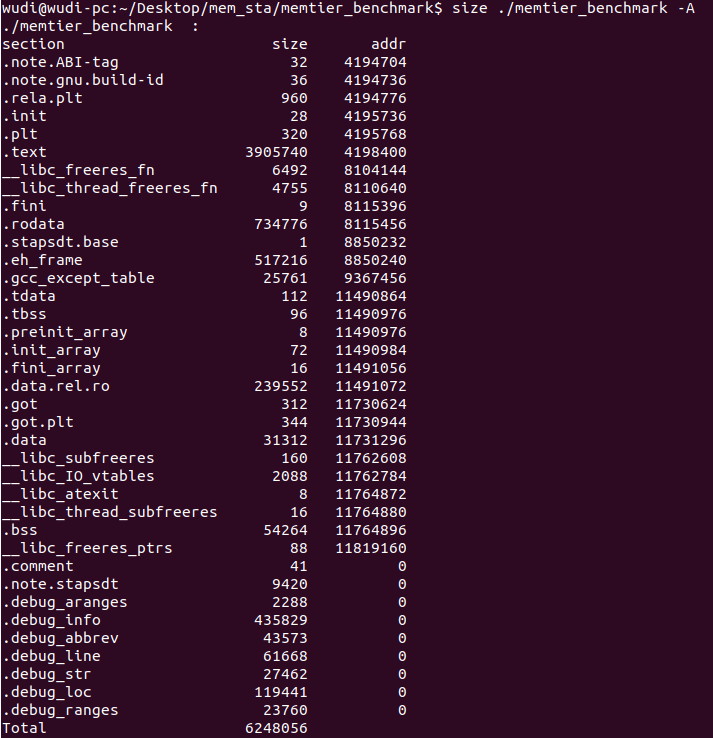

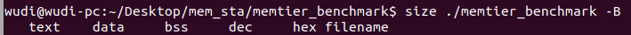

### time

保存在/memtier_benchmark_dynamic/time下

保存在/memtier_benchamrk_static/time下

### cache-misses(dynamic)

### 

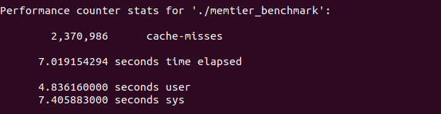

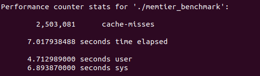

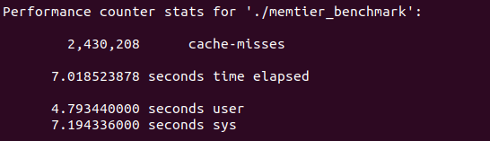

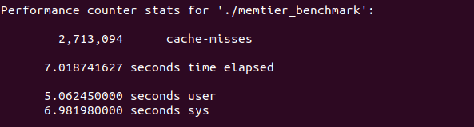

### cache-misses(static)

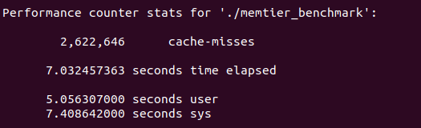

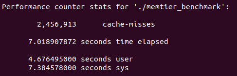

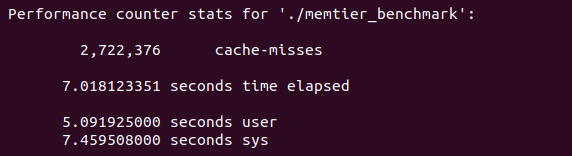

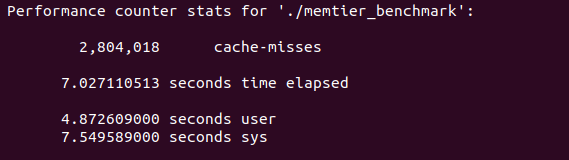

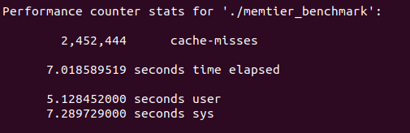
