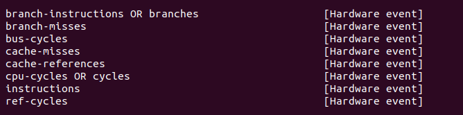

## node && npm

https://blog.csdn.net/weixin_43157543/article/details/114305812 node和npm升级排坑（升级成功提示，但是查看版本却没有变化）

可以通过which npm或者whereis npm找到npm的具体位置

https://www.jianshu.com/p/2797b0322946 更新node版本

## 通过axios连接后端

https://panjiachen.github.io/vue-element-admin-site/zh/guide/essentials/server.html#%E5%89%8D%E7%AB%AF%E8%AF%B7%E6%B1%82%E6%B5%81%E7%A8%8B 和服务端进行交互

## 画图

https://echarts.apache.org/en/index.html echarts官网，主要修改option就行了

## JavaScript

https://www.w3schools.com/js/ js官网，能自己试，主要可以看看各个js是干嘛的

## ip
sudo apt install net-tools
ifconfig -a

## sqlite
sudo apt install sqlite3

should install an visualize tool

## run the shell
use os.system()  tongbude

## haowen

http://zhengheng.me/2015/11/12/perf-stat/ 讲述了很多指标的意义

可参考的输出

perf stat -e task-clock,instructions,branches,branch-misses,L1-dcache-loads,L1-dcache-load-misses,LLC-loads,LLC-load-misses,L1-icache-load-misses,dTLB-loads,dTLB-load-misses,iTLB-load-misses

